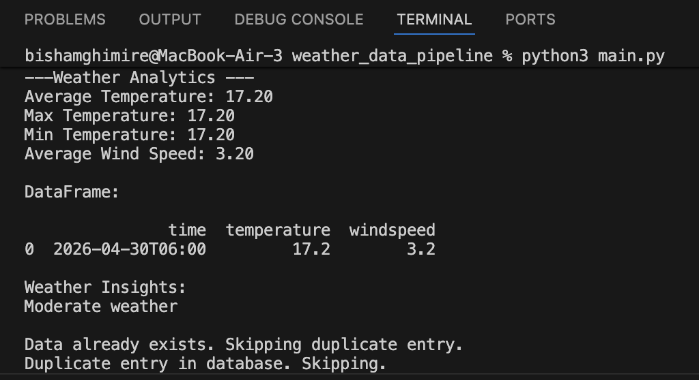

# 🌦️ Weather Data Pipeline

## Overview

I built this project to understand how a simple API script can be turned into a structured data pipeline. Instead of only fetching weather data, the pipeline processes it, validates it, stores it, and keeps track of each run.

The pipeline collects current weather data for Austin, Texas from the Open-Meteo API, checks that required fields are present, and stores each observation in both a CSV file and a SQLite database. It also records whether each pipeline run was successful or failed.

---

## Installation

### 1. Clone the repository

```bash
git clone https://github.com/Bisham62/weather-data-pipeline.git
cd weather-data-pipeline
```

### 2. Create a virtual environment (optional but recommended)

On macOS/Linux:

```bash
python3 -m venv .venv
source .venv/bin/activate
```

On Windows:

```bash
python -m venv .venv
.venv\Scripts\activate
```

### 3. Install the required packages

```bash
pip install -r requirements.txt
```

The project uses `pandas` and `requests`. SQLite is included with Python, so it does not require a separate installation.

---

## How to Run

From inside the project folder, run:

```bash
python main.py
```

If your system uses `python3`, run:

```bash
python3 main.py
```

Each run:

1. Fetches current weather data from the Open-Meteo API
2. Validates the required fields: `time`, `temperature`, and `windspeed`
3. Processes the data using pandas
4. Prints basic temperature and wind statistics
5. Saves the observation to `weather_data.csv` if the timestamp is not already stored
6. Inserts the observation into `weather.db` if it is not already stored
7. Records the pipeline run as `SUCCESS` or `FAILED`

The SQLite database `weather.db` is created locally and is not committed to Git.

---

## Project Structure

```text
weather-data-pipeline/
│
├── main.py
├── fetch.py
├── process.py
├── storage.py
├── db.py
├── requirements.txt
├── weather_data.csv
├── weather.png
├── .gitignore
└── README.md
```

### What Each File Does

- `main.py` – runs the full pipeline and tracks whether each run succeeds or fails
- `fetch.py` – requests current weather data from the Open-Meteo API
- `process.py` – validates required fields and converts the API response into a pandas DataFrame
- `storage.py` – saves observations to CSV and prevents new duplicate timestamps
- `db.py` – handles SQLite storage and pipeline run tracking
- `requirements.txt` – lists the Python packages required to run the project
- `.gitignore` – prevents local/generated files such as `weather.db` from being committed
- `weather_data.csv` – stores a CSV copy of collected weather observations
- `weather.png` – example output from a pipeline run

---

## How the Pipeline Works

The project follows a simple data pipeline:

**Fetch → Validate → Analyze → Store → Track**

Each stage is separated into its own Python file. This makes the project easier to understand, debug, and extend.

---

## Data-Quality Features

The pipeline includes several checks to make the collected data more reliable.

- **API timeout:** The request waits a maximum of 10 seconds for a response.
- **API error handling:** HTTP and network errors are handled instead of allowing the pipeline to fail without a clear message.
- **Required-field validation:** Records are checked for `time`, `temperature`, and `windspeed` before they are processed.
- **Duplicate handling:** The same timestamp is not added again to the CSV file or SQLite weather table.
- **Run tracking:** Each execution is recorded as `SUCCESS` or `FAILED`, making it easier to monitor pipeline behavior.

---

## Features

- Fetches current weather data from an API
- Processes structured data using pandas
- Validates required weather fields
- Prevents new duplicate observations
- Stores data in CSV format
- Stores data in a SQLite database
- Tracks pipeline runs
- Calculates basic weather statistics, including:
  - average temperature
  - maximum temperature
  - minimum temperature
  - average wind speed

---

## Example Output



---

## Technologies Used

- Python
- pandas
- requests
- SQLite
- Git and GitHub

---

## Limitations

- The pipeline currently collects only the current weather observation rather than a historical weather archive.
- The location is fixed to Austin, Texas (`latitude=30.2672`, `longitude=-97.7431`).
- The pipeline must currently be run manually with `python main.py`.
- There is no interactive dashboard or automated visualization.
- Older rows in `weather_data.csv` may contain duplicate timestamps from before duplicate checking was implemented. New pipeline runs prevent additional duplicates.

---

## Takeaway

This project helped me understand how data moves through a pipeline from collection and validation to analysis and storage. It also gave me practical experience working with APIs, pandas, SQLite, data-quality checks, duplicate handling, error handling, and pipeline run tracking.

Building the project in separate modules also helped me understand how a data pipeline can be organized so that it is easier to maintain and expand.
